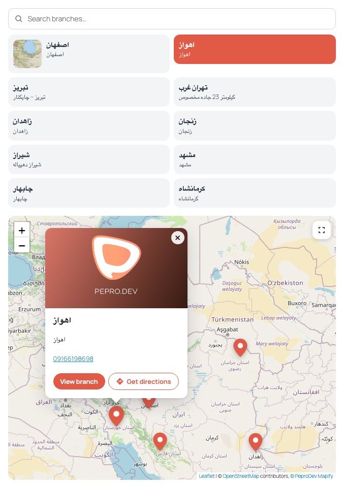
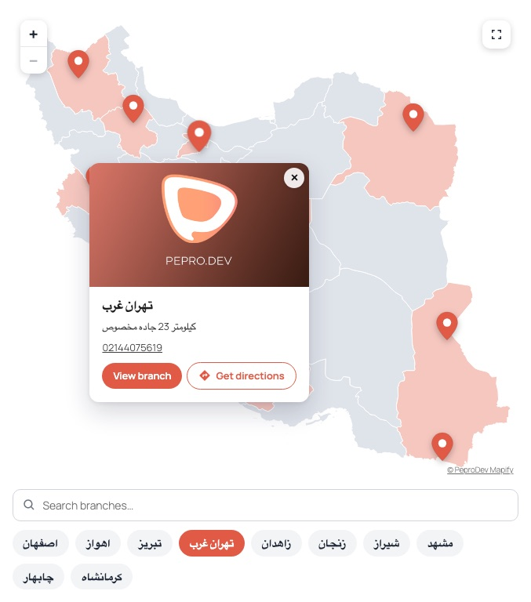
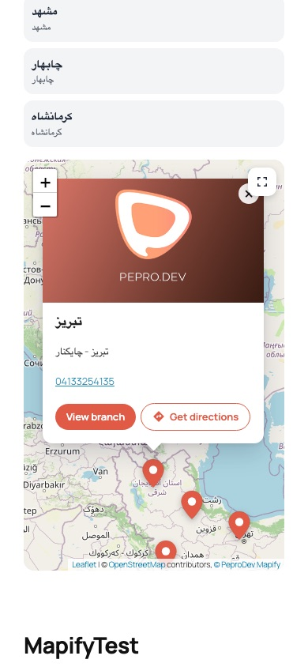
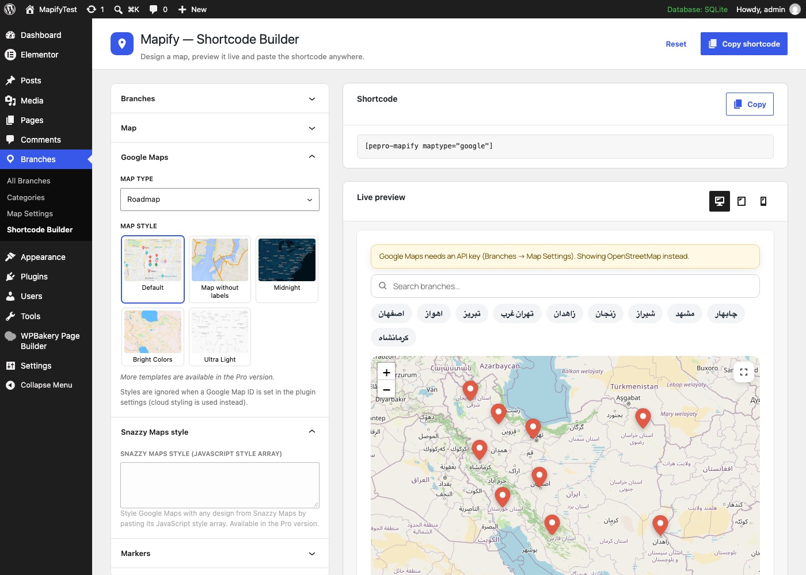
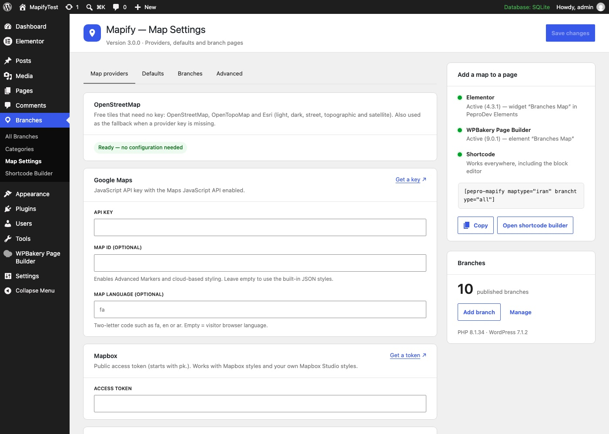
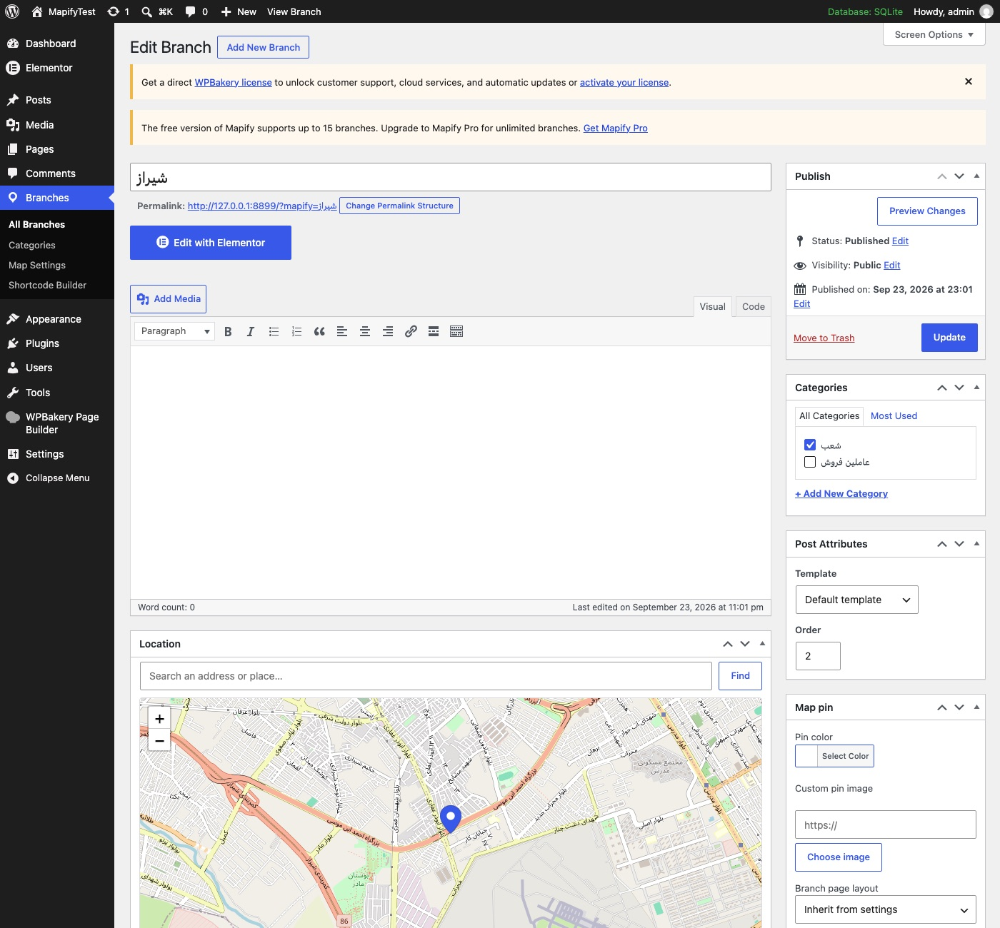
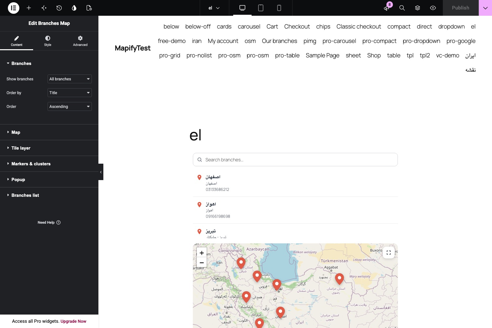
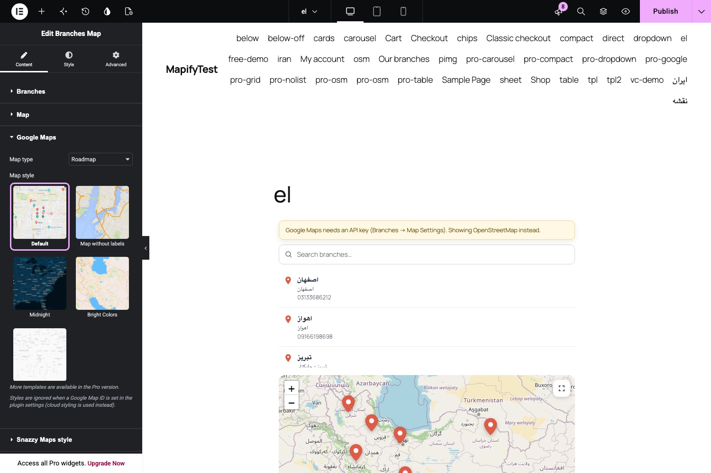
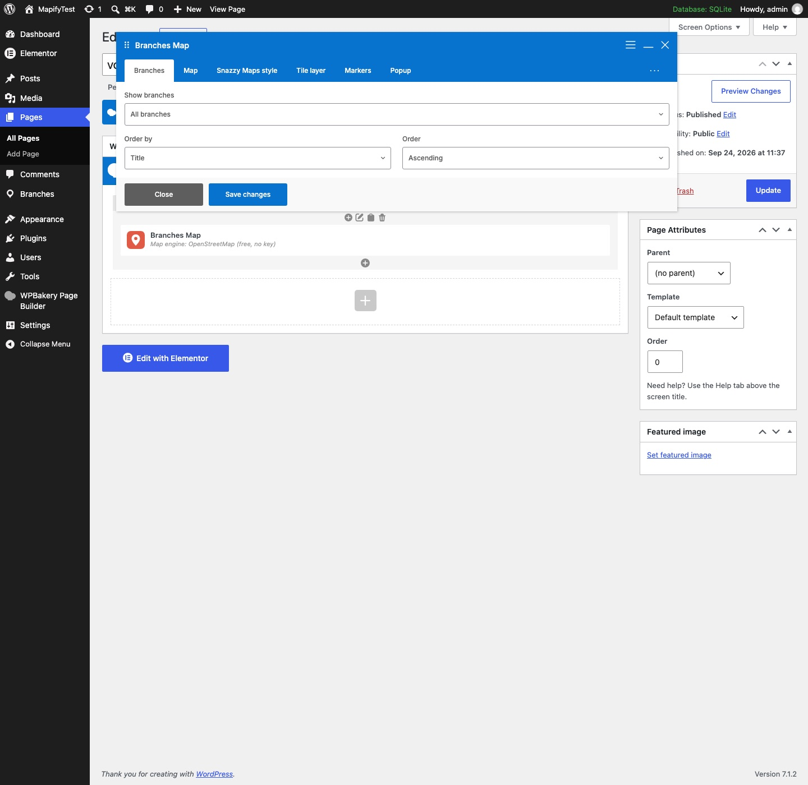
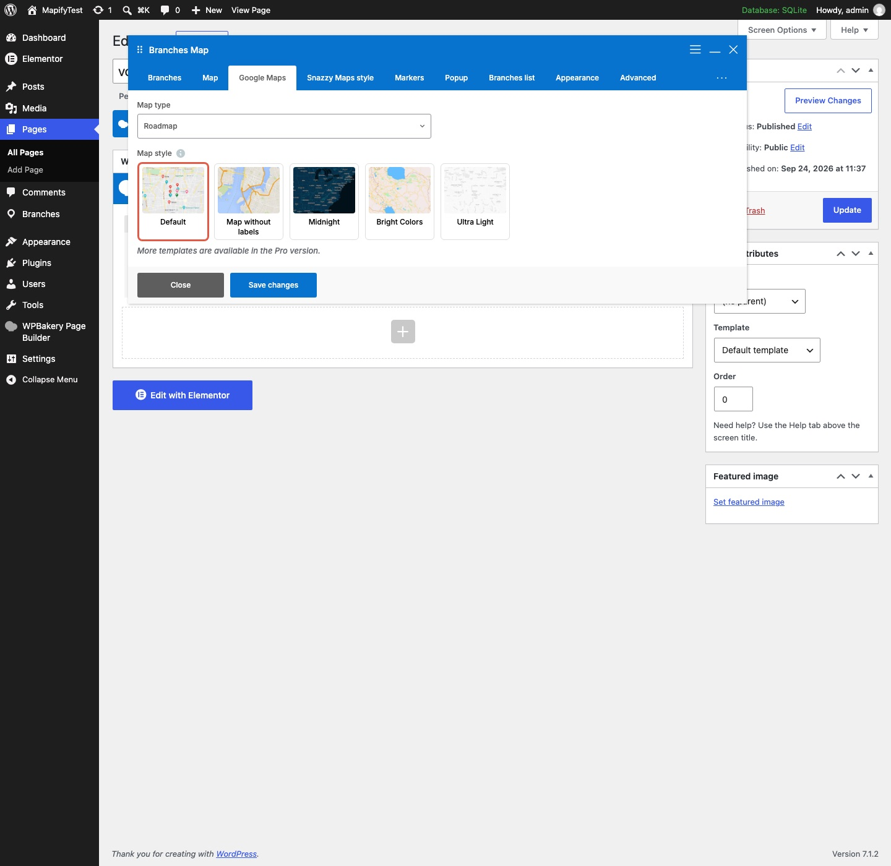

# PeproDev Branches Map (Mapify)

Show your branches on **OpenStreetMap, Google Maps, Mapbox, Map.ir, Neshan, Parsimap, Mapup**, any XYZ tile server or a bundled **offline map of Iran** — as an **Elementor widget**, a **WPBakery Page Builder element** or a **shortcode**.

*Version 3.0.0* · Requires WordPress 6.5+ (tested 7.1.2), PHP 7.4+ (tested 8.5), Elementor 4.3.1, WPBakery 9.0.1 · by [Pepro Dev](https://pepro.dev/), lead programmer [Amirhosseinhpv](https://hpv.im/)



## Features

**Maps**

- 20 free tile styles with no key: OpenStreetMap (standard, grayscale, dark, vintage, Humanitarian, France, Germany), CyclOSM, OpenTopoMap and Esri (light, dark, street, topographic, National Geographic, satellite, satellite with labels, terrain, shaded relief, physical, ocean)
- Google Maps with five built-in styles or a cloud Map ID
- Mapbox, Map.ir, Neshan, Parsimap, Mapup and any XYZ tile server
- Offline map of Iran (SVG, 31 provinces, no external requests)
- Zoom buttons, mouse wheel, double click and pinch zoom on every engine, including the offline Iran map

**Branches list and popups**

- Three layouts: chips, cards and a detailed list, with a search box and grouping by category
- Picking a branch scrolls the page to the map and opens its popup (both can be turned off)
- Pin color and pin image per branch
- Popup template with tags; popup image from the featured image or the pin image
- Get directions button: Android lists the map apps installed on the phone, other devices open Google Maps

**Admin**

- Map Settings (providers, defaults, branch pages) and a Shortcode Builder with live preview, built with WordPress components
- Thumbnail gallery pickers for tile and Google styles in Elementor, WPBakery and the Shortcode Builder
- Branch editor with an OpenStreetMap location picker and address search
- Up to 15 branches

**Translation**

- WPML: `wpml-config.xml` makes branches, branch categories, branch details and the texts of the Elementor widget and the shortcode translatable
- Polylang support for the texts entered in Map Settings
- Every interface text, in PHP and JavaScript, uses the `mapify` text domain; Persian (fa_IR) translation included, full RTL support

## Screenshots

| | |
|---|---|
| <br>Offline Iran map with the chips layout | <br>Popup with the Get directions button on a phone |
| <br>Shortcode Builder with the Google Maps style picker | <br>Map Settings |
| <br>Branch editor with the location picker | <br>Elementor: Branches Map widget |
| <br>Elementor: Google Maps style gallery | <br>WPBakery: Branches Map element |
| <br>WPBakery: Google Maps style picker | |

## Installation

1. Upload the plugin zip in Plugins → Add New → Upload, or copy the folder to `/wp-content/plugins/mapify/`, then activate it.
2. Add branches under **Branches → Add New Branch** and pick their location on the map.
3. Optional: add API keys under **Branches → Map Settings** (Google Maps, Mapbox, Map.ir, Neshan, Parsimap). OpenStreetMap, Esri, Mapup and the offline Iran map work without keys.
4. Add the map with the Elementor widget “Branches Map” (in **PeproDev Elements**), the WPBakery element, or the shortcode.

## Shortcode

```
[pepro-mapify maptype="iran" branchplacement="end" list_layout="cards"]
[pepro-mapify maptype="osm" osm_style="osm-dark" list_layout="list" list_scroll_to_map="no"]
[pepro-mapify maptype="osm"]<h3>{title}</h3>{address}{directions}[/pepro-mapify]
```

Every widget setting is a shortcode attribute. Use **Branches → Shortcode Builder** to generate shortcodes with a live preview.

Popup tags: `{id} {title} {image} {pin_image} {popup_image} {url} {latitude} {longitude} {address} {phone} {site} {email} {twitter} {facebook} {instagram} {telegram} {linkedin} {additional} {categories} {directions}`. `{image}` is always the featured image, `{popup_image}` follows the “Popup image” setting. Use `{tag|fallback}` for a default value.

## REST API

| Route | Access | Returns |
|---|---|---|
| `GET /wp-json/wp/v2/mapify` | public (edit: `edit_posts`) | Branches with `meta` (`place_details_*`) and `mapify_location` `{latitude, longitude, zoom}` |
| `GET /wp-json/wp/v2/mapify_category` | public (edit: `manage_categories`) | Branch categories |
| `GET /wp-json/mapify/v1/branches?category=a,b&include=1,2&search=…` | public | Published branches as the map uses them |
| `GET /wp-json/mapify/v1/categories` | public | Categories with branch counts |

## For developers

The plugin exposes PHP filters and a small JavaScript API so add-ons can extend it without changing its files:

- PHP: `mapify_init`, `mapify_register_assets`, `mapify_enqueue_front`, `mapify_options_schema`, `mapify_schema_groups`, `mapify_render_settings`, `mapify_front_config`, `mapify_list_item_html`, `mapify_branch_export`, `mapify_translatable_strings` and more (see `includes/`)
- JavaScript: `window.Mapify.extend( function ( map ) { … } )` runs for every map; maps emit `mount`, `ready`, `popup`, `popupData`, `popupHtml`, `activate`, `directions` and `refresh` events, and `map.addFilter( name, { test, active } )` adds list / map filters
- Admin: `wp.hooks` filters `mapify.settings.tabs`, `mapify.settings.tab`, `mapify.settings.advanced` and `mapify.builder.actions`

## Structure

| Path | What it does |
|---|---|
| `pepro-mapify.php` | Bootstrap |
| `includes/class-schema.php` | One settings schema used by the shortcode, Elementor, WPBakery and the builder |
| `includes/class-renderer.php` | Server-side markup + front-end config |
| `includes/class-options.php` | Global settings (`mapify_settings`, REST-enabled) |
| `includes/class-i18n.php` | WPML / Polylang helpers |
| `includes/class-admin.php` | Settings page, Shortcode Builder, live preview endpoint |
| `includes/class-branches.php` / `class-branch-editor.php` | Post type, REST meta, branch editor |
| `includes/class-transfer.php` | `mapify/v1` REST routes, category export in Tools → Export |
| `includes/integrations/elementor/` | Elementor widget and the thumbnail gallery control |
| `includes/integrations/wpbakery/` | WPBakery element |
| `assets/js/mapify-front.js` | All engines (Google, Leaflet tiles, Neshan SDK, offline map), list, filters, directions |
| `assets/js/admin.js` | Settings + builder UI (`@wordpress/components`, no build step) |
| `assets/img/tile-style/`, `assets/img/map-style/` | Tile style and Google style thumbnails |
| `assets/maps/iran.svg` | Offline Iran provinces map (geoBoundaries, CC BY 4.0) |
| `assets/vendor/` | Leaflet 1.9.4, Leaflet.markercluster 1.5.3, @googlemaps/markerclusterer 2.6.2 |
| `wpml-config.xml` | WPML configuration |
| `.github/screenshots/` | Screenshots used in this README (not part of the plugin zip) |

## Changelog

### 3.0.0

- Rewritten for PHP 7.4 – 8.5, WordPress 7.1, Elementor 4.3 and WPBakery 8/9
- New map engines: OpenStreetMap (20 free tile styles), Mapbox, Map.ir, Neshan, Parsimap, Mapup, custom XYZ tiles and an offline map of Iran
- New Elementor widget with full Style controls, and a WPBakery element rebuilt with param groups and Design Options
- Thumbnail gallery pickers for tile styles and Google styles
- Settings page and Shortcode Builder with live preview, built with WordPress components
- New branch editor with an OpenStreetMap location picker and address search
- Chips, cards and detailed list layouts; picking a branch scrolls to the map and opens its popup
- Popup image setting, `{image}`, `{pin_image}`, `{popup_image}` and `{directions}` popup tags
- Get directions button (installed map apps on Android, Google Maps elsewhere)
- Zoom settings on every map, including the offline Iran map
- REST API routes for branches and categories; branch categories in Tools → Export
- WPML (`wpml-config.xml`) and Polylang support
- Popup templates are sanitized; no more `eval()`
- Removed the Google tile-URL hack ("Development mode") and the custom Google logo option
- Up to 15 branches

### 1.3.6

- Plugin name fixes

### 1.3.5

- JavaScript issue with the latest Visual Composer fixed

### 1.3.4.1

- Google Chrome 84+ compatible

### 1.3.4

- Category name fix

### 1.3.3

- Fixed branches data not saving
- Fixed compatibility with WordPress 5.5

### 1.3.2

- Fixed MITM attack issue

### 1.3.1

- Dependency-free marker maker added
- Removed custom CSS styles from the Visual Composer widget
- Branches metabox class renamed to `PeproBranchesCPT_metabox`
- Directory index blocked for resources

### 1.3.0

- Initial release for GitHub and WordPress

## Credits

Iran map boundaries: [geoBoundaries](https://www.geoboundaries.org/) (CC BY 4.0). Tile style thumbnails in `assets/img/tile-style/`: © OpenStreetMap contributors, OpenStreetMap France / Germany, CyclOSM, OpenTopoMap, Esri and its data providers. Google style thumbnails and the “Map without labels” style: [Snazzy Maps](https://snazzymaps.com/?ref=mapify&utm_source=mapify&utm_medium=wordpress-plugin). Leaflet and Leaflet.markercluster: BSD-2 / MIT.
