# PeproDev Branches Map (Mapify)

Show your branches on **Google Maps, OpenStreetMap, Mapbox, Map.ir, Neshan, Parsimap, Mapup**, any XYZ tile server, **your own SVG or image**, or a bundled **offline map of Iran** — as an **Elementor widget**, a **WPBakery Page Builder element** or a **shortcode**.

*Version 2.5.0* · Requires WordPress 6.5+ (tested 7.1.2), PHP 7.4+ (tested 8.5.8), Elementor 4.3.1, WPBakery 8.2 · by [Pepro Dev](https://pepro.dev/), lead programmer [Amirhosseinhpv](https://hpv.im/)

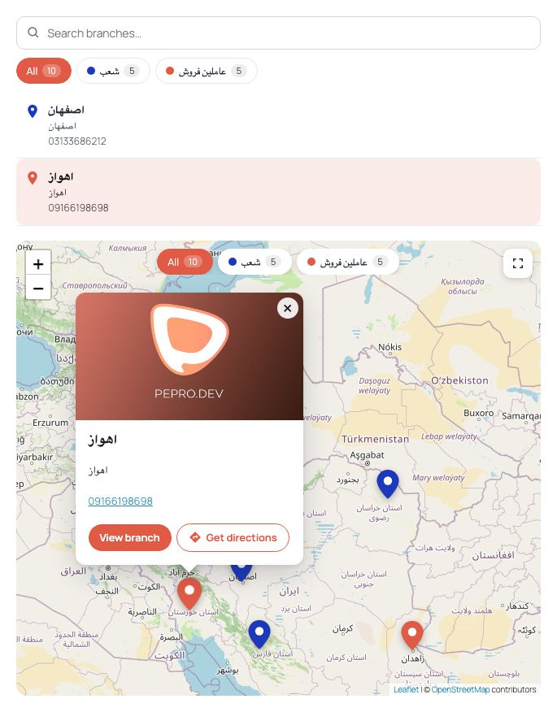

## Features

**Maps**

- 20 free tile styles with no key: OpenStreetMap (standard, grayscale, dark, vintage, Humanitarian, France, Germany), CyclOSM, OpenTopoMap and Esri (light, dark, street, topographic, National Geographic, satellite, satellite with labels, terrain, shaded relief, physical, ocean)
- Google Maps with 70+ built-in styles, any [Snazzy Maps](https://snazzymaps.com/explore?ref=mapify&utm_source=mapify&utm_medium=wordpress-plugin) style, or a cloud Map ID
- Mapbox, Map.ir, Neshan, Parsimap, Mapup and any XYZ tile server
- Offline map of Iran, your own SVG map, or any image as a map (floor plans, campus maps)
- Zoom buttons, mouse wheel, double click and pinch zoom on every engine, including the Iran, SVG and image maps

**Branches list**

- Eight layouts: chips, cards, detailed list, image grid, compact numbered list, table, carousel and dropdown
- Search box, grouping by category and category chips under the search box and on the map (one or several categories)
- Picking a branch scrolls the page to the map and opens its popup (both can be turned off)

**Pins and popups**

- Pin color and pin image per branch or per category
- Popup template with tags; popup image from the featured image or the pin image
- Get directions button: Android lists the map apps installed on the phone, other devices get a configurable app list (Google Maps, Apple Maps, Waze, Neshan, Balad or your own), or the phone's default map app opens directly

**Admin**

- Map Settings (providers, defaults, branch pages, navigation apps, import / export, attribution) and a Shortcode Builder with live preview, built with WordPress components
- Thumbnail gallery pickers for tile and Google styles in Elementor, WPBakery and the Shortcode Builder
- JSON import / export of settings, categories and branches; branches and categories in Tools → Export and in the REST API
- Persian (fa_IR) translation and full RTL support

## Screenshots

| | |
|---|---|
| 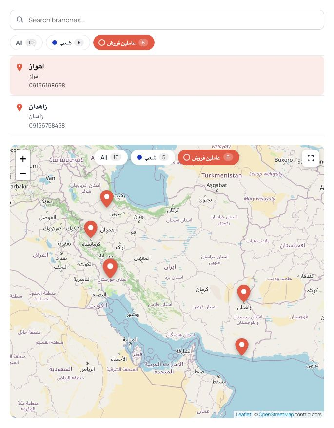<br>Category chips on the map show only the chosen category | 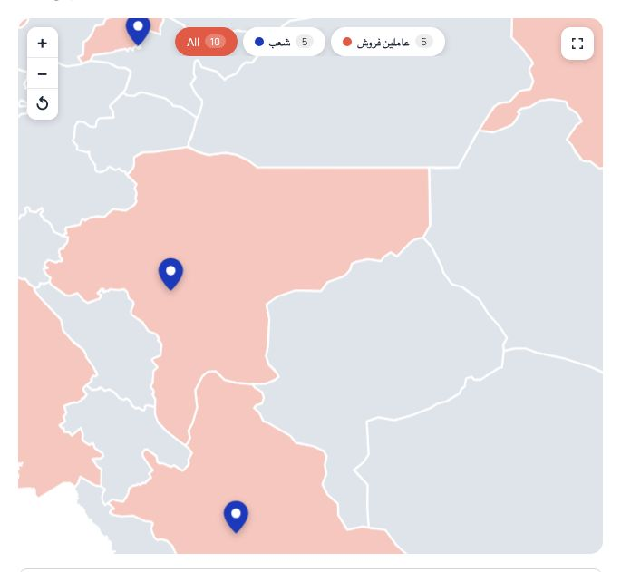<br>Offline Iran map with zoom and pan |
| 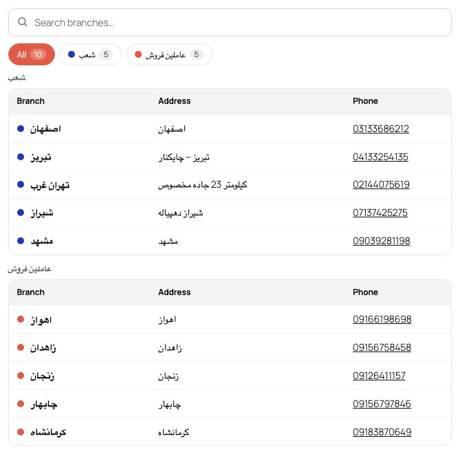<br>Table layout, grouped by category | 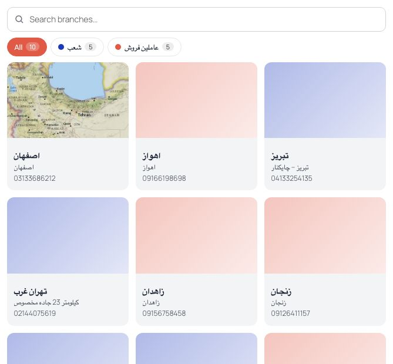<br>Image grid layout |
| 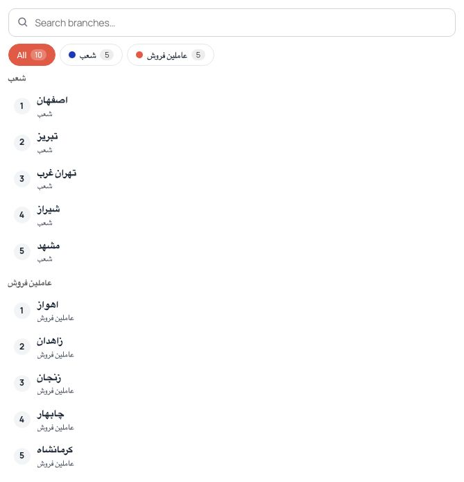<br>Compact numbered list | 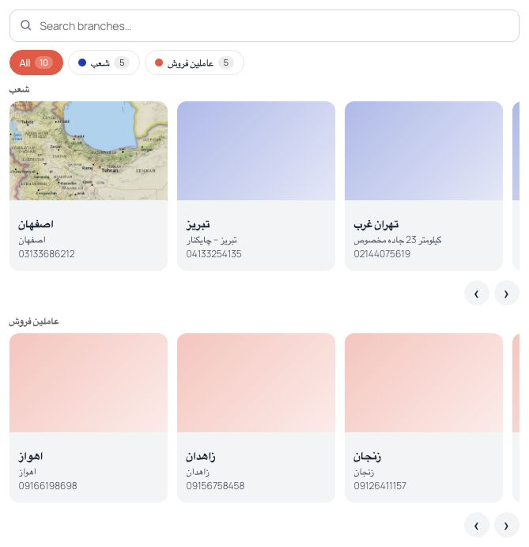<br>Carousel layout |
| <br>Popup with the Get directions button | 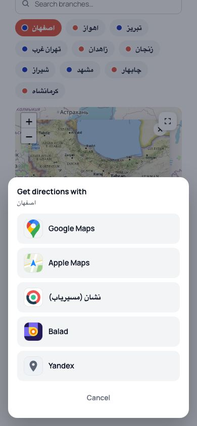<br>Directions app list on iPhone |
| 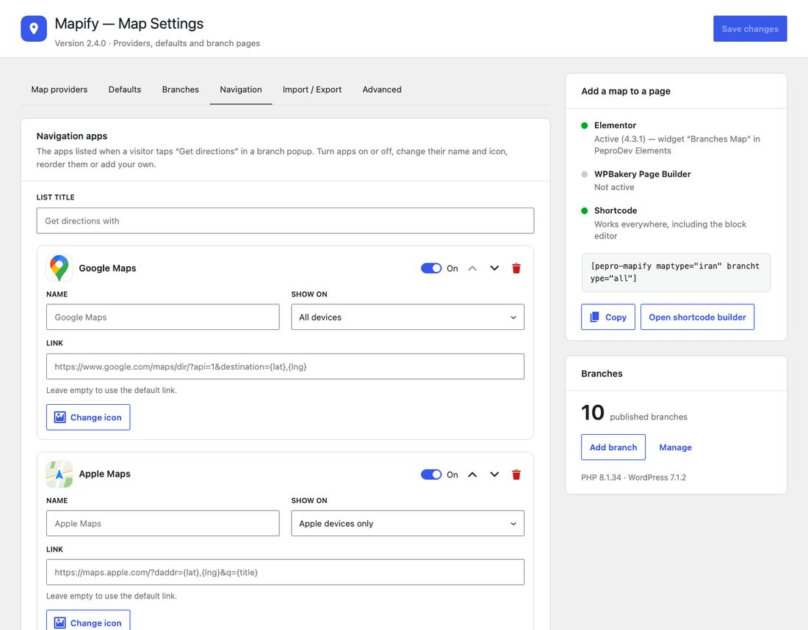<br>Map Settings → Navigation | 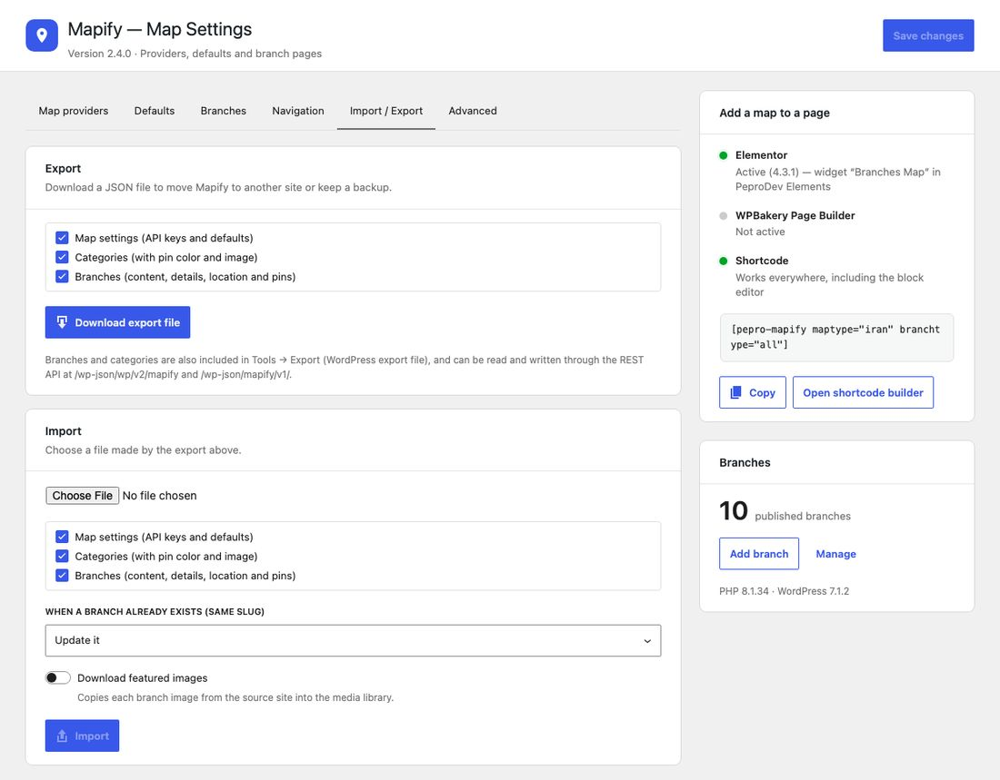<br>Map Settings → Import / Export |
| 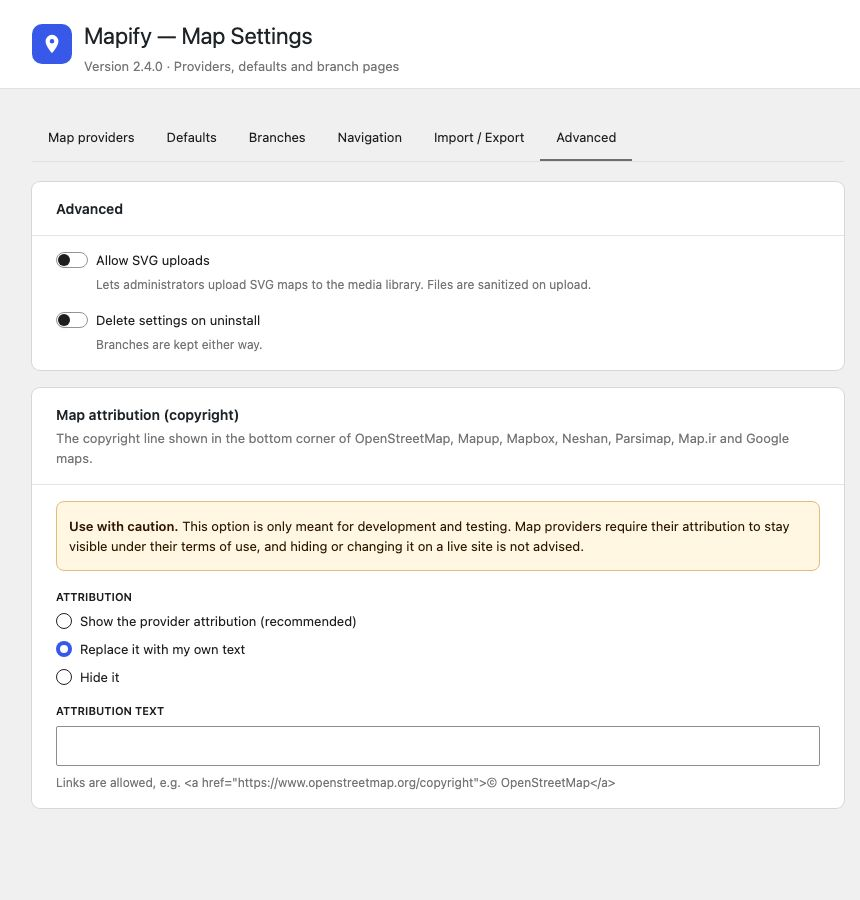<br>Map attribution (development use only) | 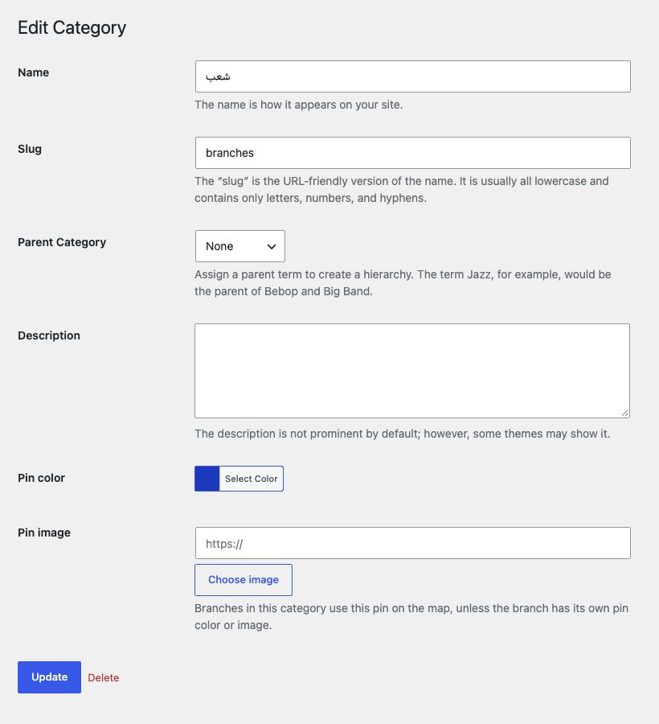<br>Pin color and image per category |
| 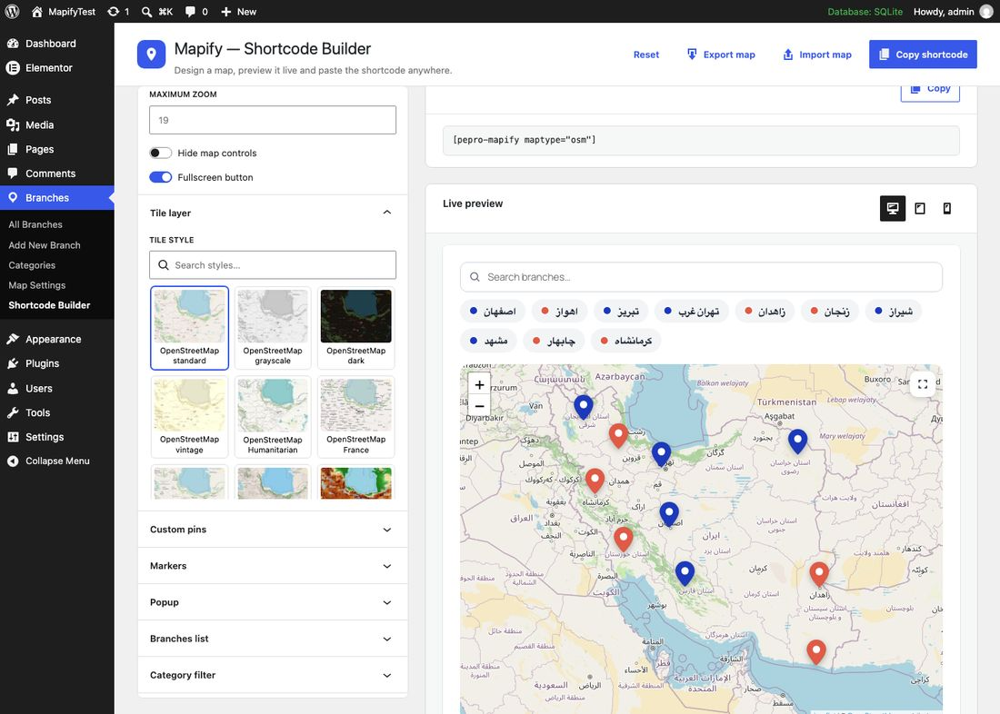<br>Shortcode Builder with the tile style gallery | 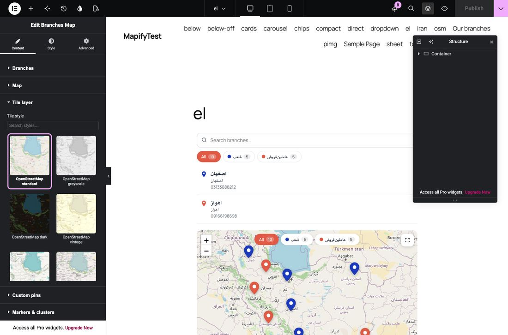<br>Elementor: tile style gallery and live preview |
| 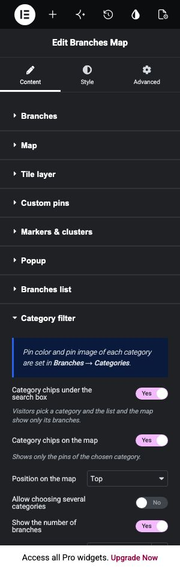<br>Elementor: Category filter section | 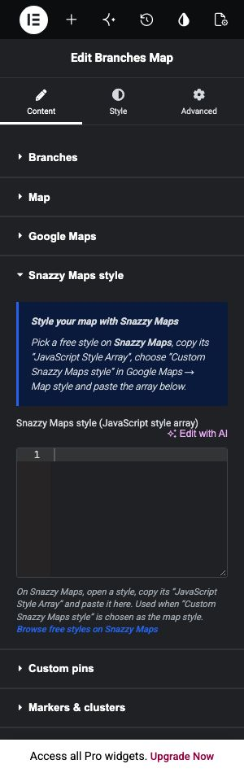<br>Elementor: Snazzy Maps style section |

More screenshots (every Elementor and WPBakery panel, Persian versions) are kept outside the plugin source, in the `screenshots/` folder next to `source/`.

## Installation

1. Upload the plugin zip in Plugins → Add New → Upload, or copy the folder to `/wp-content/plugins/mapify/`, then activate it.
2. Add branches under **Branches → Add New Branch** and pick their location on the map.
3. Optional: add API keys under **Branches → Map Settings** (Google Maps, Mapbox, Map.ir, Neshan, Parsimap). OpenStreetMap, Esri, Mapup and the offline Iran map work without keys.
4. Add the map with the Elementor widget “Branches Map” (in **PeproDev Elements**), the WPBakery element, or the shortcode.

## Shortcode

```
[pepro-mapify maptype="iran" branchplacement="end" list_layout="cards"]
[pepro-mapify maptype="osm" osm_style="osm-dark" list_cat_filter="yes" map_cat_filter="yes"]
[pepro-mapify maptype="osm" directions_mode="direct" list_scroll_to_map="no"]
[pepro-mapify maptype="image" map_image="123" pins="…urlencoded JSON…" branchtype="none"]
[pepro-mapify maptype="osm"]<h3>{title}</h3>{address}{directions}[/pepro-mapify]
```

Every widget setting is a shortcode attribute. Use **Branches → Shortcode Builder** to generate shortcodes with a live preview.

Popup tags: `{id} {title} {image} {pin_image} {popup_image} {url} {latitude} {longitude} {address} {phone} {site} {email} {twitter} {facebook} {instagram} {telegram} {linkedin} {additional} {categories} {directions}`. `{image}` is always the featured image, `{popup_image}` follows the “Popup image” setting. Use `{tag|fallback}` for a default value.

## REST API

| Route | Access | Returns |
|---|---|---|
| `GET /wp-json/wp/v2/mapify` | public (edit: `edit_posts`) | Branches with `meta` (`place_details_*`) and `mapify_location` `{latitude, longitude, zoom}` |
| `GET /wp-json/wp/v2/mapify_category` | public (edit: `manage_categories`) | Categories with `meta.mapify_pin_color` / `meta.mapify_pin_image` |
| `GET /wp-json/mapify/v1/branches?category=a,b&include=1,2&search=…` | public | Published branches as the map uses them |
| `GET /wp-json/mapify/v1/categories` | public | Categories with pin settings and counts |
| `GET /wp-json/mapify/v1/export?settings=1&categories=1&branches=1` | `manage_options` | Export file (JSON) |
| `POST /wp-json/mapify/v1/import` | `manage_options` | `{data, settings, categories, branches, existing: update\|skip\|duplicate, images}` → counts |

## Structure

| Path | What it does |
|---|---|
| `pepro-mapify.php` | Bootstrap |
| `includes/class-schema.php` | One settings schema used by the shortcode, Elementor, WPBakery and the builder |
| `includes/class-renderer.php` | Server-side markup + front-end config |
| `includes/class-options.php` | Global settings (`mapify_settings`, REST-enabled), navigation apps |
| `includes/class-admin.php` | Settings page, Shortcode Builder, live preview endpoint |
| `includes/class-branches.php` / `class-branch-editor.php` | Post type, REST meta, category pin settings, branch editor |
| `includes/class-transfer.php` | `mapify/v1` REST routes, JSON import / export, WXR category export |
| `includes/integrations/elementor/` | Elementor widget and the thumbnail gallery control |
| `includes/integrations/wpbakery/` | WPBakery element |
| `assets/js/mapify-front.js` | All engines (Google, Leaflet tiles, Neshan SDK, SVG/image planes), filters, directions |
| `assets/js/admin.js` | Settings + builder UI (`@wordpress/components`, no build step) |
| `assets/img/tile-style/`, `assets/img/map-style/`, `assets/img/nav/` | Tile style and Google style thumbnails, navigation app icons |
| `assets/maps/iran.svg` | Offline Iran provinces map (geoBoundaries, CC BY 4.0) |
| `assets/vendor/` | Leaflet 1.9.4, Leaflet.markercluster 1.5.3, @googlemaps/markerclusterer 2.6.2 |
| `.github/screenshots/` | Screenshots used in this README (not part of the plugin zip) |

## Changelog

### 2.5.0

- The free version supports up to 15 branches; Mapify Pro removes the limit

### 2.4.1

- Removed unused images from version 1 (old marker set and placeholder files); the plugin is about 5 MB smaller
- readme.txt and README updated with features, screenshots and the full changelog

### 2.4.0

- Picking a branch in the list scrolls the page to the map when the map is out of view, and opens the branch popup
- Two new list settings to turn the scroll and the popup off

### 2.3.0

- Map Settings → Navigation: turn navigation apps on or off, rename them, change their icons, reorder them, choose the devices they show on, and add your own apps with a link template (`{lat} {lng} {title} {address}`)
- App icons for Google Maps, Apple Maps, Waze, Neshan, Balad and other phone apps in the directions list
- New Get directions action: open the phone's default map app directly, without the list
- “Map without labels” Google style from Snazzy Maps
- Snazzy Maps style section: paste a style's JavaScript style array (JSON or a full `var styles = [...]` snippet), with a link to Snazzy Maps

### 2.2.0

- 12 more free tile styles (no key): OpenStreetMap grayscale, dark and vintage, OpenStreetMap France and Germany, CyclOSM, National Geographic, satellite with labels, terrain, shaded relief, physical and ocean
- Thumbnail gallery picker for tile styles and Google styles in Elementor, with search; the same thumbnails in WPBakery and the Shortcode Builder
- Popup tags: `{image}` is always the featured image, new `{pin_image}` and `{popup_image}` (follows the “Popup image” setting)

### 2.1.0

- Category filter chips under the search box and on the map, with single or multiple selection
- Pin color and pin image per category; branch pin settings still win
- Six new list layouts: detailed list, image grid, compact numbered list, table, carousel and dropdown
- Popup image setting (featured image, branch pin image, featured then pin, none) and placeholder toggle
- Get directions button in popups with the installed map apps on Android and an app list elsewhere; `{directions}` popup tag
- Zoom settings: buttons and their position, mouse wheel, double click, pinch, minimum and maximum zoom; zoom and pan on the offline Iran, SVG and image maps
- Import / export of settings, categories and branches (JSON), and export / import of a single map in the Shortcode Builder
- REST API: branch meta, category pin meta and a `mapify_location` field in `wp/v2`; new `mapify/v1` routes (branches, categories, export, import)
- Tools → Export includes branch categories with their pin settings when only Branches are exported
- Map attribution can be replaced or hidden (development use only)
- Elementor and WPBakery category renamed to “PeproDev Elements”

### 2.0.0

- Rewritten for PHP 7.4 – 8.5, WordPress 7.1, Elementor 4.2 and WPBakery 8/9
- New Elementor widget with full Style controls
- WPBakery element rebuilt with vc_lean_map, param groups and Design Options
- New engines: OpenStreetMap, Mapbox, Map.ir, Neshan, Parsimap, Mapup, custom XYZ tiles, offline Iran SVG, custom SVG and image maps
- Custom pins with relative (%) or absolute (px) positions, or latitude/longitude
- Settings page and Shortcode Builder built with WordPress components
- New branch editor with OpenStreetMap location picker
- Popup templates are sanitized; SVG uploads are sanitized; no more `eval()`
- Removed the Google tile-URL hack ("Development mode") and the custom Google logo option

### 1.3.6

- Plugin name fixes

### 1.3.5

- JavaScript issue with the latest Visual Composer fixed

### 1.3.4.1

- Google Chrome 84+ compatible

### 1.3.4

- Category name fix

### 1.3.3

- Fixed branches data not saving
- Fixed compatibility with WordPress 5.5

### 1.3.2

- Fixed MITM attack issue

### 1.3.1

- Dependency-free marker maker added
- Removed custom CSS styles from the Visual Composer widget
- Branches metabox class renamed to `PeproBranchesCPT_metabox`
- Directory index blocked for resources

### 1.3.0

- Initial release for GitHub and WordPress

## Credits

Iran map boundaries: [geoBoundaries](https://www.geoboundaries.org/) (CC BY 4.0). Tile style thumbnails in `assets/img/tile-style/`: © OpenStreetMap contributors, OpenStreetMap France / Germany, CyclOSM, OpenTopoMap, Esri and its data providers. Google style thumbnails and the “Map without labels” style: [Snazzy Maps](https://snazzymaps.com/?ref=mapify&utm_source=mapify&utm_medium=wordpress-plugin). Navigation app icons in `assets/img/nav/` are trademarks of their owners and are used only to identify the apps. Leaflet and Leaflet.markercluster: BSD-2 / MIT.
